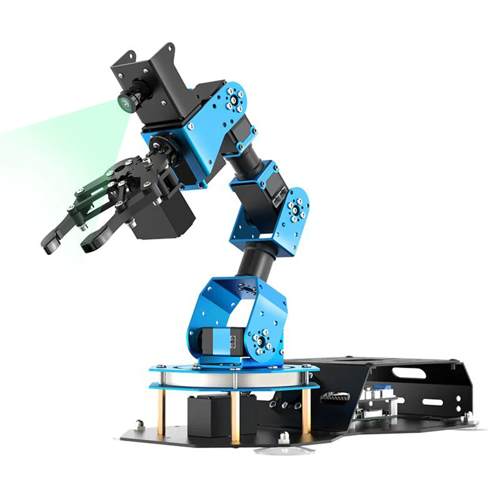

# ArmPi FPV

[English](https://github.com/Hiwonder/ArmPi-FPV/blob/main/README.md) | 中文

<p align="center">
  
</p>

基于树莓派的智能视觉机械臂，搭载高清170°广角摄像头，集成ROS和MoveIt运动学，支持人脸识别、颜色追踪、码垛、智慧仓储等多种AI视觉功能。

## 产品介绍

ArmPi FPV智能视觉机械臂以树莓派5/树莓派4B为主控，OpenCV为图像处理库，搭载高清170°广角摄像头，拥有第一视觉。它采用ROS机器人操作系统，内置MoveIt运动学。通过Python编程，它可以实现人脸识别、颜色追踪、码垛、智慧仓储等多种AI视觉识别功能！它不仅能满足用户对机器视觉、机械臂运动控制、力矩控制等算法的学习和验证，还为手眼协作、视觉抓取等二次开发提供快速、便捷的集成方案。

## 官方资源

### Hiwonder官方
- **官方网站**: [https://www.hiwonder.net/](https://www.hiwonder.net/)
- **产品页面**: [https://www.hiwonder.com/products/armpi-fpv](https://www.hiwonder.com/products/armpi-fpv)
- **官方文档**: [https://docs.hiwonder.com/projects/ArmPi_FPV/en/latest/](https://docs.hiwonder.com/projects/ArmPi_FPV/en/latest/)
- **技术支持**: support@hiwonder.com

## 主要功能

### AI视觉功能
- **人脸检测** - 全面的人脸识别能力
- **颜色追踪** - 实时基于颜色的目标追踪
- **目标追踪** - 先进的物体检测和追踪
- **视觉抓取** - 手眼协调精确物体操作
- **AprilTag识别** - 基于标签的精确定位

### 高级应用
- **物品码垛** - 自动化堆叠和码垛操作
- **智慧仓储** - 智能仓库管理和分拣
- **物品分拣** - 基于颜色和形状的分拣自动化
- **多机群控** - 多台机械臂协同控制
- **语音控制** - ASR驱动的语音命令

### 运动控制
- **逆运动学** - 先进的运动规划算法
- **MoveIt集成** - 完整的MoveIt运动规划支持
- **力矩控制** - 精确的力和力矩管理
- **轨迹规划** - 平滑的路径生成和执行
- **舵机控制** - 高精度总线舵机管理

### 编程接口
- **ROS集成** - 完整的机器人操作系统支持
- **Python编程** - 全面的Python SDK
- **MoveIt API** - 运动规划和控制接口
- **OpenCV库** - 计算机视觉和图像处理
- **开源平台** - 完整的开源平台支持定制化

## 硬件配置
- **处理器**: 树莓派5或树莓派4B
- **操作系统**: ROS Noetic兼容Linux系统
- **视觉系统**: 高清170°广角摄像头
- **舵机**: 高精度总线舵机
- **自由度**: 多自由度机械臂
- **通信**: WiFi、蓝牙

## 项目结构

```
armpi_fpv/
├── src/                          # ROS源码包
│   ├── armpi_fpv_bringup/        # 系统启动和配置
│   ├── armpi_fpv_common/         # 公共工具和库
│   ├── armpi_fpv_descrption/     # 机器人URDF描述
│   ├── armpi_fpv_kinematics/     # 运动学算法
│   ├── armpi_fpv_moveit_config/  # MoveIt配置
│   ├── asr_control/              # 语音控制模块
│   ├── face_detect/              # 人脸检测
│   ├── hiwonder_servo_controllers/ # 舵机控制器
│   ├── hiwonder_servo_driver/    # 舵机硬件驱动
│   ├── hiwonder_servo_msgs/      # 舵机消息定义
│   ├── lab_config/               # 颜色标定配置
│   ├── multi_control/            # 多机器人控制
│   ├── object_pallezting/        # 码垛应用
│   ├── object_sorting/           # 物品分拣应用
│   ├── object_tracking/          # 物体追踪应用
│   ├── ros_robot_controller/     # 硬件控制器接口
│   └── warehouse/                # 智慧仓储应用
├── build/                        # 编译文件
├── devel/                        # 开发文件
└── sources/                      # 资源和文档
```

## 版本信息
- **当前版本**: ArmPi FPV v1.0.0
- **支持平台**: 树莓派5、树莓派4B
- **ROS版本**: ROS1 (Noetic)

### 相关技术
- [ROS](http://www.ros.org/) - 机器人操作系统
- [MoveIt](https://moveit.ros.org/) - 运动规划框架
- [OpenCV](https://opencv.org/) - 计算机视觉库
- [Python](https://www.python.org/) - 编程语言

---

**注**: 所有程序已预装在ArmPi FPV机器人系统中，可直接运行。详细使用教程请参考[官方文档](https://docs.hiwonder.com/projects/ArmPi_FPV/en/latest/)。
